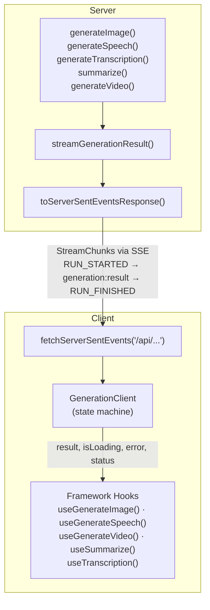

# Generations

TanStack AI provides a unified pattern for non-chat AI activities: **image generation**, **text-to-speech**, **transcription**, **summarization**, and **video generation**. These are collectively called "generations" — single request/response operations (as opposed to multi-turn chat).

All generations follow the same architecture, making it easy to learn one and apply it to the rest.

## Architecture



The key insight: **every generation activity on the server is just an async function that returns a result**. The `streamGenerationResult()` helper wraps that result into a `StreamChunk` iterable that the client already knows how to consume.

## Two Transport Modes

### Streaming Mode (Connection Adapter)

The server wraps the generation in `streamGenerationResult()` and sends it as SSE. The client uses `fetchServerSentEvents()` to consume the stream.

**Server:**

```typescript
import {
  streamGenerationResult,
  generateImage,
  toServerSentEventsResponse,
} from '@tanstack/ai'
import { openaiImage } from '@tanstack/ai-openai'

// In your API route handler
const stream = streamGenerationResult(() =>
  generateImage({
    adapter: openaiImage('dall-e-3'),
    prompt: 'A sunset over mountains',
  }),
)

return toServerSentEventsResponse(stream)
```

**Client:**

```tsx
import { useGenerateImage } from '@tanstack/ai-react'
import { fetchServerSentEvents } from '@tanstack/ai-client'

const { generate, result, isLoading } = useGenerateImage({
  connection: fetchServerSentEvents('/api/generate/image'),
})
```

### Direct Mode (Fetcher)

The client calls a server function directly and receives the result as JSON. No streaming protocol needed.

**Server:**

```typescript
import { createServerFn } from '@tanstack/react-start'
import { generateImage } from '@tanstack/ai'
import { openaiImage } from '@tanstack/ai-openai'

export const generateImageFn = createServerFn({ method: 'POST' })
  .inputValidator((data: { prompt: string }) => data)
  .handler(async ({ data }) => {
    return generateImage({
      adapter: openaiImage('dall-e-3'),
      prompt: data.prompt,
    })
  })
```

**Client:**

```tsx
import { useGenerateImage } from '@tanstack/ai-react'
import { generateImageFn } from '../lib/server-functions'

const { generate, result, isLoading } = useGenerateImage({
  fetcher: (input) => generateImageFn({ data: input }),
})
```

## How streamGenerationResult Works

`streamGenerationResult()` takes any async function and wraps its result as a sequence of `StreamChunk` events:

```
1. RUN_STARTED          → Client sets status to 'generating'
2. CUSTOM               → Client receives the result
   name: 'generation:result'
   value: <your result>
3. RUN_FINISHED         → Client sets status to 'success'
```

If the function throws, a `RUN_ERROR` event is emitted instead:

```
1. RUN_STARTED          → Client sets status to 'generating'
2. RUN_ERROR            → Client sets error + status to 'error'
   error: { message: '...' }
```

This is the same event protocol used by chat streaming, so the same transport layer (`toServerSentEventsResponse`, `fetchServerSentEvents`) works for both.

## Common Hook API

All generation hooks share the same interface:

| Option | Type | Description |
|--------|------|-------------|
| `connection` | `ConnectionAdapter` | Streaming transport (SSE, HTTP stream, custom) |
| `fetcher` | `(input) => Promise<Result>` | Direct async function (no streaming) |
| `id` | `string` | Unique identifier for this instance |
| `body` | `Record<string, any>` | Additional body parameters (connection mode) |
| `onResult` | `(result) => T \| null \| void` | Transform or react to the result |
| `onError` | `(error) => void` | Error callback |
| `onProgress` | `(progress, message?) => void` | Progress updates (0-100) |

| Return | Type | Description |
|--------|------|-------------|
| `generate` | `(input) => Promise<void>` | Trigger generation |
| `result` | `T \| null` | The result (optionally transformed), or null |
| `isLoading` | `boolean` | Whether generation is in progress |
| `error` | `Error \| undefined` | Current error, if any |
| `status` | `GenerationClientState` | `'idle'` \| `'generating'` \| `'success'` \| `'error'` |
| `stop` | `() => void` | Abort the current generation |
| `reset` | `() => void` | Clear all state, return to idle |

### Result Transform

The `onResult` callback can optionally transform the stored result:

- Return a **non-null value** — replaces the stored result with the transformed value
- Return **`null`** — keeps the previous result unchanged (useful for filtering)
- Return **nothing** (`void`) — stores the raw result as-is

TypeScript automatically infers the result type from your `onResult` return value — no explicit generic parameter needed.

```tsx
const { result } = useGenerateSpeech({
  connection: fetchServerSentEvents('/api/generate/speech'),
  onResult: (raw) => ({
    audioUrl: `data:${raw.contentType};base64,${raw.audio}`,
    duration: raw.duration,
  }),
})
// result is typed as { audioUrl: string; duration?: number } | null
```

## Available Generations

| Activity | Server Function | Client Hook (React) | Guide |
|----------|----------------|---------------------|-------|
| Image generation | `generateImage()` | `useGenerateImage()` | [Image Generation](./image-generation) |
| Text-to-speech | `generateSpeech()` | `useGenerateSpeech()` | [Text-to-Speech](./text-to-speech) |
| Transcription | `generateTranscription()` | `useTranscription()` | [Transcription](./transcription) |
| Summarization | `summarize()` | `useSummarize()` | - |
| Video generation | `generateVideo()` | `useGenerateVideo()` | [Video Generation](./video-generation) |

> **Note:** Video generation uses a jobs/polling architecture. The `useGenerateVideo` hook additionally exposes `jobId`, `videoStatus`, `onJobCreated`, and `onStatusUpdate` for tracking the polling lifecycle. See the [Video Generation](./video-generation) guide for details.
